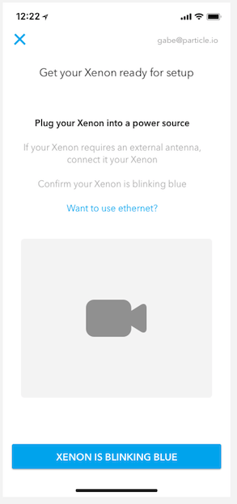

# Chapter 1: Claiming Your first Mesh Device

| **Project Goal**            | Get your Particle Xenon online and claimed to your account                                                               |
| --------------------------- | ------------------------------------------------------------------------------------------------------------------------ |
| **What you’ll learn**       | How to claim a new Particle Xenon using the mobile app; Using the Ethernet shield to add network capabilities to a Xenon |
| **Tools you’ll need**       | A Xenon, Ethernet Shield, Ethernet switch access, the Particle Mobile App                                                |
| **Time needed to complete** | 15 minutes                                                                                                               |

In this lab, you'll claim your first Particle Mesh device, the Xenon, with the help of the Particle mobile app and an Ethernet shield. Once you've claimed your Xenon, you'll use [Tinker](https://docs.particle.io/guide/getting-started/tinker/photon/) on the Particle mobile app to interact with your new device.

## Before you start

1.  Create a new [Particle account](https://login.particle.io/signup)
2.  Install the Particle [iOS](https://itunes.apple.com/us/app/particle-build-photon-electron/id991459054?ls=1&mt=8) or [Android](https://play.google.com/store/apps/details?id=io.particle.android.app) App

## Setting up a Xenon & Ethernet shield

1. Open your Xenon Kit. Remove the Xenon and USB cable.

2. Remove the Ethernet shield from its box.

3. Insert the Xenon into the Ethernet shield. Make sure to align the headers so that the 12-pin side of the Xenon is inserted into the 12-pin header on the shield, and the 16-pin side of the Xenon is inserted into the 16-pin header on the shield.

4. Find an available Ethernet cable at your table and plug it into the Ethernet shield.

5. Take the USB cable that came with your Xenon, plug the larger end into your laptop and the USB mini connector into the Xenon. Once the Xenon powers up, it will automatically enter "[listening mode](https://docs.particle.io/guide/getting-started/modes/photon/#listening-mode)", which means its ready to be claimed.

## Claiming the Xenon from mobile

**Note**: Images below are from the iOS app. The flow of the Android setup experience is similar.

1.  Open the Particle Mobile App.

2.  Login, or create a new account if you don't already have one.

3.  On the "Your Devices" screen, click the "+" in the top-right to add a new device.

4.  Select the "Xenon" option.

5.  If you haven't done so already, plug your device into power using a USB cable. You can connect to a computer, though this is not required when using the mobile app.

Make sure your device is in "Listening Mode" (aka blinking blue). If the Xenon is not in listening mode, hold down the `MODE` button for three seconds, until the RGB LED begins blinking blue.

6.  The next screen will instruct find the data matrix printed on your Xenon and scan it with your Phone's camera. Make sure to allow the app to access your camera to complete this step.

7. The app will now use Bluetooth to pair with your device so that it can be added to the Particle Device Cloud and associated with your account.

8. Since you're bringing a new Xenon online and don't yet have a Mesh network configured, the app will next make sure you've connected your Xenon to an Ehternet FeatherWing.

9. Once your device has been added to the Device Cloud and associated with your account, you'll want to give it a name and click "Next."

10. Congratulations, you've claimed your first Xenon. We'll set-up a Mesh network and second device in the next lab. For now, let's play with your new Xenon via Tinker [using the instructions below](#interacting-with-your-xenon-with-tinker)!

## Interacting with your Xenon with Tinker

Now that you've claimed your Xenon, let's light up an LED!

**Note**: images below are from the iOS app. The flow of the Android setup experience is similar.

1.  Open the Particle Mobile App.

2.  Your new device should show up in the list with the name you gave it. If the Tinker firmware is still on the device, you'll see that indicated as well. If Tinker is not still on the device, you can flash it back onto the device using the Particle CLI with the command `particle flash <deviceName> tinker`.

Tap the device you want to interact with via Tinker.

3.  When you select a device flashed with the Tinker firmware, you'll see a list of all the GPIO pins on the Xenon. With Tinker, you can control the digital and analog pins via reads and writes. If you have sensors or actuators connected to the Xenon, you can control them with Tinker.

4.  Every Xenon has a blue LED that's connected to pin D7, and we can use Tinker to control this LED. Tap on the circle marked "D7" and you'll see a pop-up that gives you two options, `digitalRead` and `digitalWrite`. Click on `digitalWrite`.

5.  Once you select `digitalWrite` the pin button will be highlighted in red and show its current value. At first, this value will be digital `LOW` (or 0).

6.  Tap the button. You'll notice that it changed to `HIGH` (or 1).

7.  When the value changes to high, you'll also notice that the blue light at D7 is on! Behind the scenes, Tinker is calling the `digitalWrite` and passing in either a `LOW` or `HIGH` value, which turns the LED off or on. Press the button again and you'll note that the LED turns back off.

Congratulations! You've claimed and named your first Xenon, and made it light up using the Tinker app. Now lets bring a second Xenon online and create our first Particle Mesh network!
