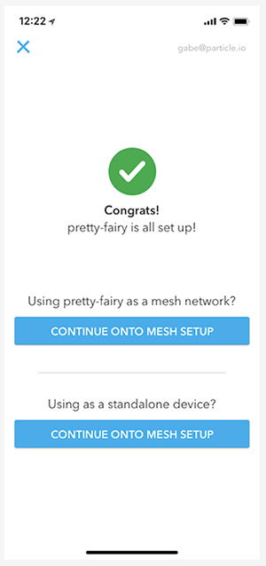
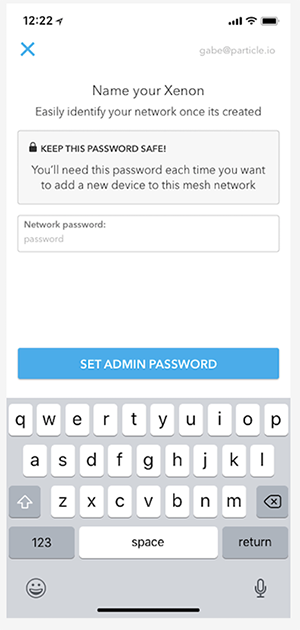
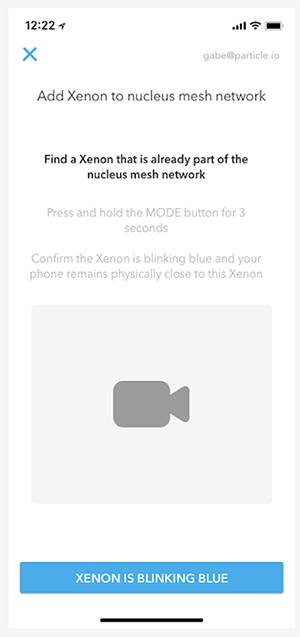
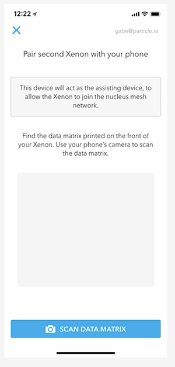
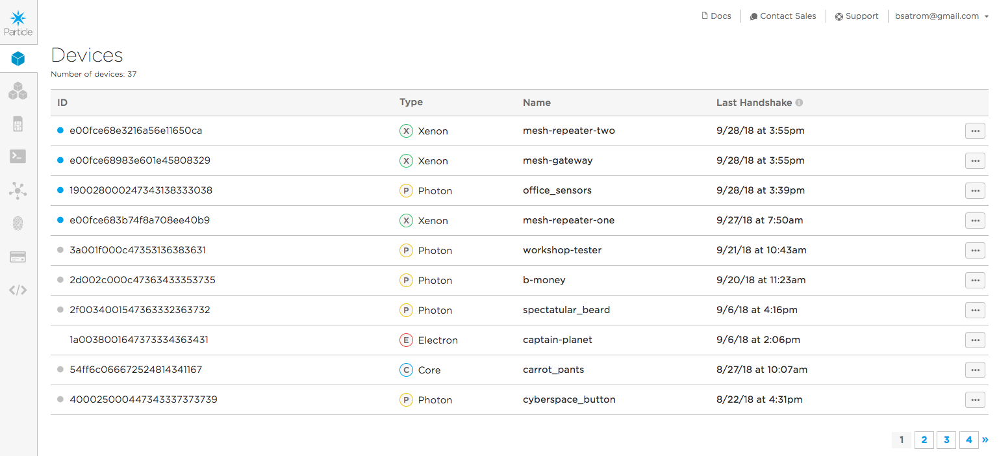
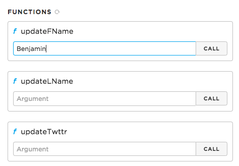
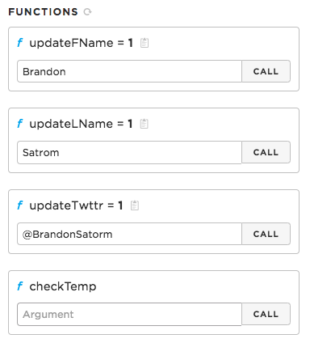
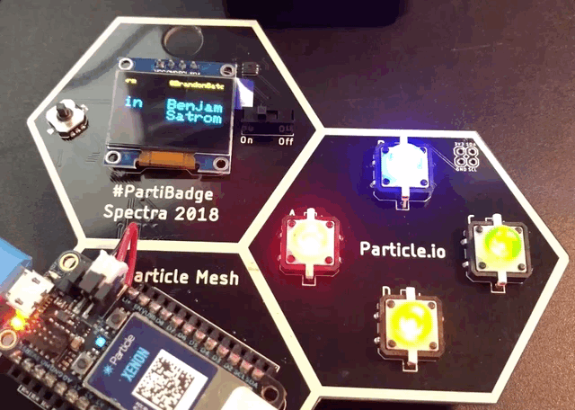

# Chapter 2: Setting up your first Mesh network

| **Project Goal**            | Create a Mesh network and connect a second Xenon to it                                                                                 |
| --------------------------- | -------------------------------------------------------------------------------------------------------------------------------------- |
| **What you’ll learn**       | How-to: create a new Particle Mesh network; add a second device to your Mesh network; communicate through a Mesh gateway to an endpoint device. |
| **Tools you’ll need**       | A Xenon, Ethernet FeatherWing, access to an Ethernet port, Xenon connected to a PartiBadge, the Particle Mobile App                             |
| **Time needed to complete** | 15 minutes                                                                                                                             |

In the last session, you configured your first Xenon. In this session, you're going to create a Particle Mesh network with your Ethernet-connected Xenon as a gateway, and then add a second Xenon (the one in your PartiBadge) to that mesh network.

## Create a Mesh Network

1. Open the Particle Mobile app. Click on the Xenon device you setup in the last lab and click "Mesh Network."

2. The app will scan for existing networks, and provide an option for creating a new network. Click on the "Create new network..." option.

3. Next, give your network a name. Try to give it a personalized name since there are going to be a lot of networks setup for this workshop.

4. And set a password for your network.

5. Once your network is configured, your Xenon will be updated with the network information and configured as a gateway.

Once your network is created, you're ready to add a second device!

## Add your PartiBadge Xenon to your Mesh Network

Your PartiBadge Xenon has already been configured with firmware and added to the Spectra mesh network. In this section, you'll claim the Xenon in your to your account and add it to your personal mesh network.

1. Once your network is configured, you'll have the option to add another device. Click "Add Next Mesh Setup" to configure another device.

2. Hold the SETUP button on your PartiBadge Xenon for three seconds until is starts blinking blue, indicating that it has entered Listening Mode.

3. Your phone will now scan for networks to join. It might find a few since we're all setting up networks at the same time, but if you gave your network a unique, recognizable name, you should find it in the list. Click your network name to select it once it shows up in the list.

4. Once you select the network, you'll be asked to make sure your device is in Listening Mode. If you didn't already do so in Step 2, put the Xenon in Listening Mode by holding down the SETUP button.

5. Now, you'll be asked to scan the data matrix on your second Xenon. Do that now, just as you did with your first device.

6. Enter the network password you specified in the last section.

Congratulations! You now have a Particle Mesh network of two devices. Let's explore the power of Mesh by controlling your Badge Xenon from the cloud.

## Explore your mini Mesh network

In the last lab, you learned how to control a Particle device running the default Tinker firmware using the mobile app. In this section, you'll use the Particle Console to control your PartiBadge using Cloud Functions, which we'll learn more about in the next module.

1. Open a browser tab and navigate to [console.particle.io](https://console.particle.io). Log in with your Particle account, if prompted.

2. Your device dashboard will show all of the Particle devices you own. You should see at least two, one for your gateway/ethernet-connected Xenon and one for your badge Xenon. Click on the badge Xenon.

3. Your PartiBadge was pre-loaded with firmware. That firmware includes several Particle Cloud Functions and variables, which you can see listed on the right side of the overview screen for your device.

4. Set the name on your badge so it can be uniquely yours! Find the function named `updateFName` and enter your first name in the text box.

5. Click `Call`. If the function call succeeded, a "1" should appear next to the function name.

6. Now, enter your last name in the `updateLName` box and click `Call`. Optionally, you can enter your Twitter handle in the `updateTwttr` box.

7. To confirm everything has been set correctly, you can click `Get` on the Particle variables for `wearerFName`, `wearerLName` and `wearerTwttr`. If the value you get back is the one you entered, you're good to go!

8. Now it's time to see your name in lights! Grab your PartiBadge and activate the menu by clicking the joystick or one of the LED buttons. Click the `Display` menu item, then `Name`. You should see your name (and Twitter handle, if your set it) scrolling across the screen!

It's important to note that the Xenon in your PartiBadge does not have a Wi-Fi or cellular radio and thus, does not have a connection to the Internet. But Particle Mesh knows that your badge is connected via your gateway, and how to route messages through the gateway to your endpoint device. All you have to do is enter some text and click buttons!

To underscore that this is the case, try accessing your badge when your gateway Xenon is disconnected.

9. Unplug the Ethernet cable from your gateway Xenon.

10. Navigate back to the [Particle Console](https://console.particle.io) and open the dashboard for your device.

11. Try changing your first or last name and clicking "Call." You should get a timeout message toast at the bottom of the screen. If you try re-displaying your name, it should be unchanged.

12. Plug an Ethernet cable back into your FeatherWing and repeat the last few steps. Everything should work.

Congratulations on setting up your first Particle Mesh network and exploring how mesh devices work together! In our last lab, you'll learn how to explicitly send messages between Mesh devices, as well as using Particle Cloud Functions, variables and Device Cloud events.
