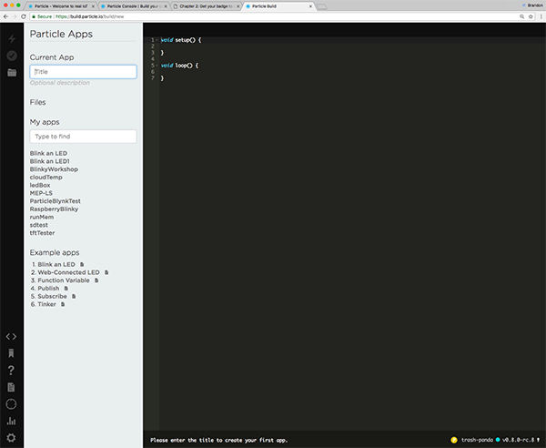
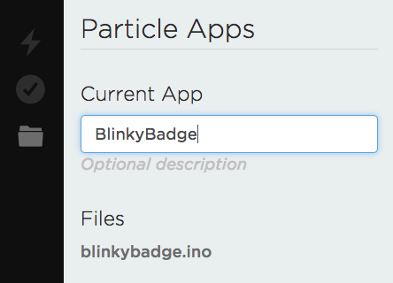
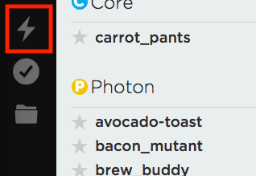
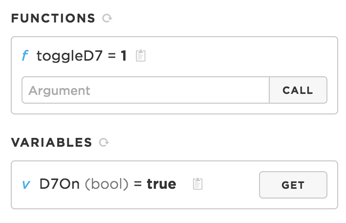

# Chapter 3: Mesh messaging and the Particle Device Cloud

| **Project Goal**            | Explore messaging between Mesh devices, and other Particle primitives.                                                            |
| --------------------------- | --------------------------------------------------------------------------------------------------------------------------------- |
| **What you’ll learn**       | How-to: use the Particle Web IDE to write device firmware; using Particle primitives to communicate between devices and networks. |
| **Tools you’ll need**       | A Xenon, Ethernet Shield, Ethernet switch access, Xenon connected to a PartiBadge, the Particle Mobile App, The Particle          |
| **Time needed to complete** | 30 minutes                                                                                                                        |

In this final session, we'll leverage our new Mesh networks to explore more of the particle system, including:

- Using Particle Web IDE to write device firmware;
- Using Mesh publish and subscribe to communicate between devices on a mesh network;
- Using Particle publish and subscribe to communicate between networks and devices;
- Using Particle functions and variables to control devices from the Cloud.

The code you'll write in this lab will live on your gateway Xenon, and communicate with your PartiBadge in a variety of ways. By the end of this session, you'll have all the tools you need to start building Particle-powered solutions with Particle Mesh!

## Using the Particle Web IDE

In this section, you'll use the Web IDE to create firmware for your gateway Xenon. The Web IDE makes it accessible to program devices and learn the Particle ecosystem without having to install a local toolchain.

1.  Navigate to [build.particle.io](http://build.particle.io). You may need to log-in, if prompted.


2.  Once you log-in, you may be directed to the Particle home page. If so, [click here to navigate](https://build.particle.io) back to Web IDE.


3.  When navigating to the Web IDE, the first thing you'll see is an empty editor window for a new project and a prompt to give that project a name.



4.  In the Current App textbox, give your app a name (like "MeshWorkshop") and hit enter.



5.  Once you've given your project a name, you're ready to code!


## The `setup()` and `loop()` functions

::: tip
If you're new to embedded or IoT development, this section is for you!
:::

Before you dive into your first bit of code, a brief word about the two functions that were auto-populated into your new app. If you've done Wiring or Particle development before, you're already familiar with these and can skip ahead. If not, read on.

Every Particle application _must_ have two functions in the main file (sometimes called a "sketch"): `setup()` and `loop()`. Both of these functions are called by the Particle Device OS.

True to its name, `setup()` runs only only once when the device starts up and is used for initializing buttons, sensors, and other things needed to get your project ready to execute.

`loop()`, on the other hand, executes over and over again as long as your firmware is running on the device. When the function is called by Device OS, the code inside executes sequentially until it reaches the closing brace of the function, before being called again.

While the speed at which the `loop()` function executes is determined by the specific hardware and the time needed to execute the use code you've written in the function, it's important to know that, much of the time, this function will run very fast.

The bulk of your program, from state management, handling user input, reading from sensors, and more will take place inside of the `loop()` function. It can take a bit of getting used to if you're not familiar with this style of development, but once you become comfortable, you'll enjoy the power this control provides you as a firmware developer.

## Exploring Mesh Publish and Subscribe

The first two Particle primitives to look at are also the newest: `Mesh.publish()` and `Mesh.subscribe()`. These primitives allow you to send and receive broadcast messages within a Particle Mesh network. Unlike `Particle.publish()` and `Particle.subscribe()` which you'll look at next, these messages can only be sent to and viewed by devices on the same Mesh network.

### Using `Mesh.publish()`

First, use `Mesh.publish()` to send a message to your badge, which has been pre-programmed to receive. Since you're working with a Xenon in an Ethernet FeatherWing, you'll use the `MODE` button on the Xenon to fire a Particle Mesh message.

1. In `setup`, add the following:

```cpp
System.on(button_click, setupHandler);
```

`System.on` registers a [system event](https://docs.particle.io/reference/firmware/photon/#system-events-overview) tied to the `MODE` button. When the button is clicked, a handler named `setupHandler` is called.

2. Add the `setupHandler` above the `setup` function and replace `<your-first-name>` with your name.

```cpp
void setupHandler()
{
    Mesh.publish("gateway-setup-clicked", "<your-first-name>");
}
```

`Mesh.publish()` is pretty simple. You pass in the name of the event and an optional data payload to pass along with the message.

When this handler is called, it will fire a multicast event to the entire Mesh network. If one or more devices on the network are listening for this event, they'll receive it and respond accordingly.

3. Let's flash this firmware to your gateway. First, click on the crosshairs icon in the left side of the Web IDE to open your devices list.


4. Find your gateway Xenon in the list and click the "star" next to its name to set it as your active device. Keep the default firmware version selection.


5. Click the lightning-bolt icon at the top left side of the screen to flash your device.



6. Once your gateway is breathing cyan again, click and release the `MODE` button. You should see your badge respond to the event with your name!

If you're interested in seeing the subscribe side of this code before you write your own, you can view it in the [GitHub repo for the PartiBadge](https://github.com/particle-iot/). The `Mesh.subscribe` code is [here](https://github.com/particle-iot/parti-badge/blob/master/firmware/src/mesh/mesh.cpp#L48) and the handler is [here](https://github.com/particle-iot/parti-badge/blob/master/firmware/src/mesh/mesh.cpp#L35).

### Using `Mesh.subscribe()`

Now let's write our own `Mesh.subscribe()` logic to receive an event preprogrammed into your badges.

1. Add the following to `setup`:

```cpp
pinMode(D7, OUTPUT);

Mesh.subscribe("gateway-ping", pingHandler);
```

In addition to setting up a subscription handler, we call `pinMode` to designate how a given General Purpose Input-Output (GPIO) pin on the Xenon will be used, either as an input (common with buttons and switches), or an output (common with LEDs, speakers and displays).

2. Above the `setup` function, add the `pingHandler`. We don't need the two parameters for this step, but they are required on all event handlers.

```cpp
void pingHandler(const char *event, const char *data) {
  digitalWrite(D7, HIGH);
  delay(2000);
  digitalWrite(D7, LOW);
}
```

When the `pingHandler` is called, it will turn the `D7` pin on by setting it `HIGH`. On every Particle device, including the Xenon, the `D7` pin is connected to an onboard blue LED. So, by setting `D7` `HIGH`, you'll be turning on that LED each time an event is received. After 2 seconds (or 2000 milliseconds), the LED will be turned off by setting it `LOW`.

3. Click the lightning icon to flash the latest code to your device. On your PartiBadge, the "gateway-ping" event is available from the "Mesh Tools" menu. Navigate to that menu and click the "Gateway Ping" menu item to fire the event. If everything works, you should see the blue LED at the top of your Gateway Xenon light up!


## Exploring Particle Publish and Subscribe

Now, let's look at `Particle.publish()` and `Particle.subscribe()`, which can be used to communicate between devices, networks and other applications from the Particle Device Cloud. Both primitives have the same signature as their `Mesh` class equivalents, so they should be straightforward to use. We'll start by publishing an event that our badges have already been set up to detect.

### Using `Particle.publish()`

1. Open your Gateway Xenon project in the Web IDE. In the last section, you created a `setupHandler` to publish a Mesh event to your badge when the `MODE` button is pressed. For `Publish`, we're just going to fire an event to your badge on a loop:

```cpp
void loop()
{
  Particle.publish("pulseLed", "red", PRIVATE); // Or "blue", "green", "yellow"
  digitalWrite(D7, HIGH);
  delay(3000);
  digitalWrite(D7, LOW);
  delay(2000);
}
```

2. On the badge itself, we've already implemented a `Particle.subscribe` that's listening for this message. Here's what it looks like.

```cpp
Particle.subscribe("pulseLed", pulseLEDHandler, MY_DEVICES);
```

```cpp
void pulseLEDHandler(const char *event, const char *data)
{
  if (data == "red")
    pulseLED(RED_LED);
  else if (data == "blue")
    pulseLED(BLUE_LED);
  else if (data == "green")
    pulseLED(GREEN_LED);
  else if (data == "yellow")
    pulseLED(YELLOW_LED);
}
```

3. Flash the latest code to your Gateway and wait a few seconds for that event to fire, at which point you should see a single LED fade in and out on your badge. Feel free to comment this code out and re-flash if you don't want it.

### Using `Particle.subscribe()`

Now let's implement a `Particle.subscribe()` handler on the gateway. Each badge publishes an event every two minutes when it reads its temp and humidity sensor. We'll listen for that event and light up the RGB LED on your Xenon using the built-in `LEDStatus` class.

1. At the top of your Gateway firmware, add the following line to create an instance of the `LEDStatus` class:

```cpp
LEDStatus blinkBlue(RGB_COLOR_BLUE, LED_PATTERN_BLINK);
```

2. Next, add a subscription to the `setup` function.

```cpp
Particle.subscribe("env-sensors", tempHandler, MY_DEVICES);
```

3. Finally, add the handler.

```cpp
void tempHandler(const char *event, const char *data) {
  blinkBlue.setActive(true);
  delay(3000);
  blinkBlue.setActive(false);
}
```

4. Flash this firmware to your gateway and wait a bit for an event to be published. You can visit your badge dashboard at [console.particle.io](https://console.particle.io) to see when the `env-sensors` event is published. When it is, the RGB LED on your gateway should blink blue for 3 seconds.

As we discussed during the session, the main difference between Mesh pub/sub and Particle pub/sub is that the former is intended for communication between devices within a network and doesn't leverage the cloud to facilitate communication. The latter, on the other hand, uses the cloud, which allows communication across networks, or even with 3rd party apps and integrations.

One way to test this is to remove the Ethernet cable from your gateway, but keep it plugged in. Then, try sending Mesh and Particle events. What happens?

For extra credit, find a partner at your table and set-up Publish/Subscribe between your gateway devices. You'll need to agree upon an event name, but you should have all the knowledge you need to make this work. If you get stuck, ask a Particle employee for help!

## Exploring Particle Variables and Functions

For the last section of this workshop, we're going to explore the final two Particle primitives, variables and functions. Let's add a variable to check the current state of the `D7` pin, and a function to toggle it `LOW` and `HIGH`.

1. First, let's add a global variable to track the state of the pin. At the top of your project, add the following:

```cpp
bool ledState = false;
```

2. Next, in `setup` add a `Particle.variable`

```cpp
Particle.variable("D7On", ledState);
```

3. Flash these changes to your device and open the Gateway dashboard in the Particle console. You should see a variable for "D7On." If you click "Get" the resulting value should be "false".


4. Now let's create a function. Add the following to your project:

```cpp
int toggleLED(String arg)
{
  ledState = !ledState;
  digitalWrite(D7, ledState);
  return 1;
}
```

5. In `setup`, create the `Particle.function`

```cpp
Particle.function("toggleD7", toggleLED);
```

6. Flash the code and refresh the device dashboard in the console. You should now see the "toggleD7" above the "D7On" variable. Click "Call." The blue D7 LED on your gateway Xenon should come on. If you click "Get" for "D7On," it should now return "true."



Congratulations, you've completed the first Particle Mesh workshop! Thanks for joining us at Spectra and being among the first to explore our new hardware and tools!
