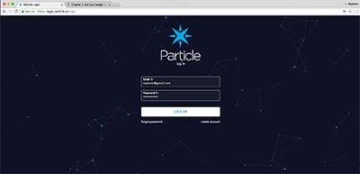
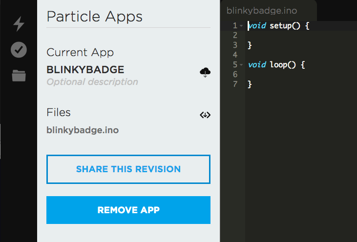

# Chapter 3: Working with sensors and the Particle Device Cloud

| **Project Goal**            | Explore messaging between Mesh devices, and other Particle primitives.                                                      |
| --------------------------- | --------------------------------------------------------------------------------------------------------------------------- |
| **What you’ll learn**       | How to: use Particle build to write device firmware; using Particle primitives to communicate between devices and networks. |
| **Tools you’ll need**       | A Xenon, Ethernet Shield, Ethernet switch access, Xenon connected to a PartiBadge, the Particle Mobile App, The Particle    |
| **Time needed to complete** | 30 minutes                                                                                                                  |

In this final session, we'll leverage our new Mesh networks to explore more of the particle system, including:

- Using Particle Build to write device firmware;
- Using Mesh publish and subscribe to communicate between devices on a mesh network;
- Using Particle publish and subscribe to communicate between networks and devices;
- Using Particle functions and variables to control devices from the Cloud.

The code you'll write in this lab will live on your Gateway Xenon, and communicate with your PartiBadge in a variety of ways. By the end of this session, you'll have all the tools you need to start building Particle-powered solutions with Particle Mesh!

## Using Particle Build

In this section, you'll use Particle Build to create firmware for your Gateway Xenon. Particle Build is a web-based IDE that makes it easy to program devices and learn the Particle ecosystem.

1.  Navigate to [build.particle.io](http://build.particle.io). You may need to log-in, if prompted.



2.  Once you log-in, you may be directed to the Particle home page. If so, [click here to navigate](https://build.particle.io) back to Particle Build.


3.  When navigating to the Web IDE (Build), the first thing you'll see is an empty editor window for a new project and a prompt to give that project a name.


4.  In the Current App textbox, give your app a name (like "MeshWorkshop") and hit enter.


5.  Once you've given your project a name, you're ready to code!



## The `setup()` and `loop()` functions

::: tip
If you're new to embedded or IoT development, this section is for you!
:::

Before we dive into our first bit of code, a brief word about the two functions that were auto-populated into your new app. If you've done Arduino or Particle development before, you're already familiar with these and can skip ahead. If not, read on.

Every Particle application _must_ have two functions in the main file (sometimes called a "sketch"): `setup()` and `loop()`. Both of these functions are called by the Particle Device OS.

True to its name, `setup()` runs only only once when the device starts up and is used for initializing buttons, sensors and other things needed to get your project ready to execute.

`loop()`, on the other hand, executes over and over again as long as your firmware is running on the device. When the function is called by the Device OS, the code inside executes sequentially until it reaches the closing brace of the function, before being called again.

While the speed at which the `loop()` function executes is determined by the specific hardware and the time needed to execute the use code you've written in the function, it's important to know that, much of the time, this function will run very fast.

The bulk of your program, from state management, handling user input, reading from sensors and more will take place inside of the `loop()` function. It can take a bit of getting used to if you're not familiar with this style of development, but once you become comfortable, you'll enjoy the power this control provides you as a firmware developer.

## Exploring Mesh Publish and Subscribe

The first two Particle primitives we'll look at are also the newest, `Mesh.publish()` and `Mesh.subscribe()`. These primitives allow us to send and receive broadcast messages within a Mesh network. Unlike `Particle.publish()` and `Particle.subscribe()` which we'll look at next, these messages can only be sent to and viewed by devices on the Mesh network.

### Using `Mesh.publish()`

First, we're going to use `Particle.publish()` to send a message to our badges, which they've been pre-programmed to receive. Since we're working with a Xenon in an Ethernet FeatherWing, we'll use the `SETUP` button on the Xenon to fire a Mesh message.

1. In `setup`, add the following:

```cpp
System.on(button_click, setupHandler);
```

`System.on` registers a [system event](https://docs.particle.io/reference/firmware/photon/#system-events-overview) tied to the `SETUP` button. When the button is clicked, a handler named `setupHandler` is called.

2. Add the `setupHandler` above the `setup` function and replace `<your-first-name>` with your name.

```cpp
void setupHandler()
{
    Mesh.publish("gateway-setup-clicked", "<your-first-name>");
}
```

`Mesh.publish()` is pretty simple. You pass in the name of the event and an optional data payload to pass along with the message.

When this handler is called, it will fire a multicast event to the entire Mesh network. If one or more devices on the network are listening for this event, they'll receive it and respond accordingly.

3. Lets flash this firmware to your gateway. First, click on the crosshairs icon in the left side of Build to open your devices list.


4. Find your gateway Xenon in the list and click the "star" next to its name to set it as your active device. Keep the default firmware selection.


5. Click the lightning-bolt icon at the top left side of the screen to flash your device.


6. Once your gateway is breathing cyan again, click and release the `SETUP` button. You should see your badge respond to the event with your name!

If you're interested in seeing the subscribe side of this code before you write your own, you can view it in the [GitHub repo for the PartiBadge](https://github.com/particle-iot/). The `Mesh.subscribe` code is [here]() and the handler is [here]().

### Using `Mesh.subscribe()`

Now let's write our own `Mesh.subscribe()` logic to receive an event preprogrammed into your badges.

1. Add the following to `setup`:

```cpp
pinMode(D7, OUTPUT);

Mesh.subscribe("gateway-ping", pingHandler);
```

In addition to setting up a subscription handler, we call `pinMode` to designate how a given General Purpose Input-Output (GPIO) pin on the Xenon will be used, either as an input (common with buttons and switches), or an output (common with LEDs, speakers and displays).

2. Above the `setup` function, add the `pingHandler`. We don't need the two parameters for this step, but they are required on all event handlers.

```cpp
void pingHandler(const char* event, const char* data) {
  digitalWrite(D7, HIGH);
  delay(2000);
  digitalWrite(D7, LOW);
}
```

When the `pingHandler` is called, it will turn the `D7` pin on by setting it high. On every Particle device, including the Xenon, the `D7` pin is connected to an onboard blue LED. So, by setting `D7` `HIGH`, you'll be turning on that LED each time an event is received. After 2 seconds (or 2000 milliseconds), the LED will be turned off.

3. Click the lightning icon to flash the latest code to your device. On your PartiBadge, the "gateway-ping" event is available from the "Mesh Tools" menu. Navigate to that menu and click the "Ping Gateway" menu item to fire the event.

## Exploring Particle Publish and Subscribe

- Particle Publish and Subscribe.
- Publish an event to the badge that fade blinks an LED.
- For extra credit, find a partner at your table and set-up Publish/Subscribe between your devices.

## Exploring Particle Variables and Functions

- Particle Variables and Functions.
- Add a variable to return the current state of the D7 pin.
- Add a function to toggle the state of the D7 pin.
