# Get your device running some code

<SessionHeader
:goal="'Get your Argon online and make it blink.'"
:time="20"
:tools="[
  'Argon',
  'USB cable',
  'Phone with Particle App',
  'Computer with Particle CLI'
  ]"
/>


In this lab, you'll claim your first Particle Mesh device, the Argon, with the help of the Particle mobile app. Once you've claimed it, you'll flash some code that blinks an LED on the Argon.

 ::: tip Do you come prepared?
 Make sure you have completed **all** the [preperations](prerequisites.md) before advancing beyond this point.
 :::

## Claim your device

Now you will set up your Argon and claim it to your Particle account.

1. Open your glorious new Argon Kit. Click on the wifi antenna to the u.fl. connector labelled *WIFI*. Afterwards, use the USB cable to plug the Argon into your computer. This should power up your device.


2. Once the Argon powers up for the first time, it will automatically enter "[listening mode](https://docs.particle.io/tutorials/device-os/led/argon/#listening-mode)" (indicated by the RGB LED blinking blue), which means it's ready to be claimed. If you need to actively put your device in to "Listening Mode", hold down the `MODE` button for three seconds, until the RGB LED begins blinking blue.


<!---->

3.  Make sure your phone has Bluetooth turned on. Open the Particle Mobile App and login to your particle account, if you have not already. 


4.  On the "Your Devices" screen, click the "+" icon to add a new device.

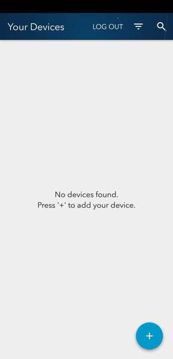
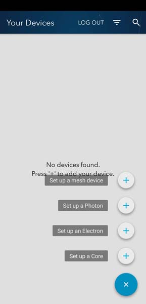

5.  Select the "Mesh" option and choose the "Argon" option.

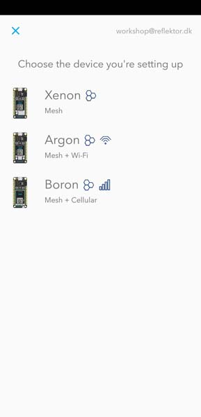

6.  The next screen will instruct you to find the data matrix printed on your Argon and scan it with your Phone's camera. Make sure to allow the app to access your camera to complete this step.

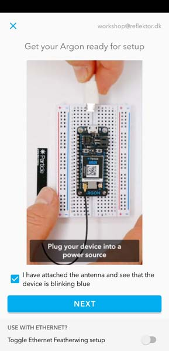
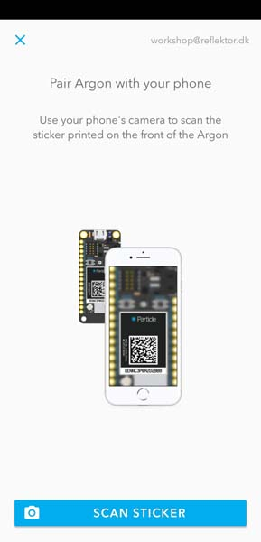

7. The app will now use Bluetooth to pair with your device. If this is the first time your Argon is connected, it is probably due for a device OS update. This is handled automatically by the App. this may take some time, depending on the number of updates pending.

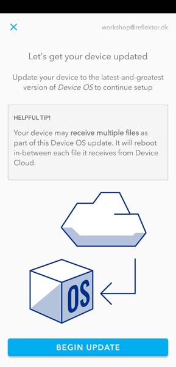
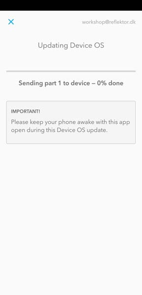

8. After the update is complete the <!--Argon will return to listeing mode (blinking blue) and the-->app will ask if you want to add the Argon to a mesh network. For now, select *NO, DON'T USE IN MESH*, as we will will explore the mesh networking capabilities later on.

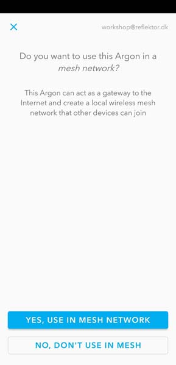

9. Conecct your device to the cloud, by providing it with wifi. Select the WiFi you intend to use, and enter the password.


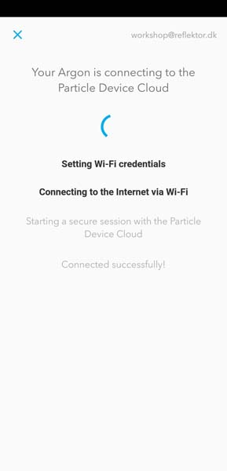

10. When your device has connected successfully, you may give it a name. After that, exit the setup.

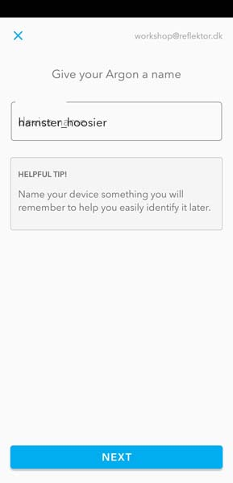
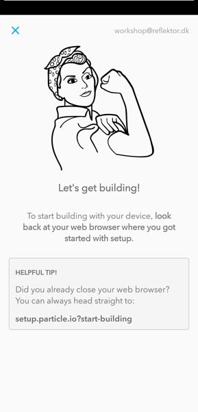

Congratulations, you've claimed your first Argon. Now, you'll program it to blink an LED.

## Program your device
You will now flash code (hardware speak for sending code to a device) from the  [Particle Web IDE](https://build.particle.io/build/) 

1. Go to the [Particle Web IDE](https://build.particle.io/build/) and login if you have not already.

2. Create a new app by submitting a title (e.g. "blinky") and press enter.

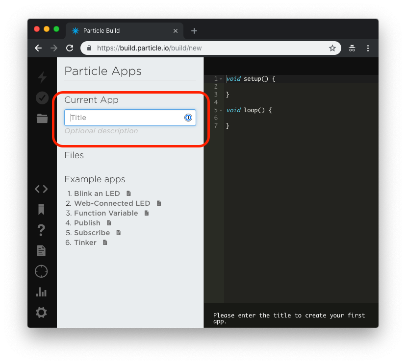

3. You should now have a dark right pane with two empty functions declared.  

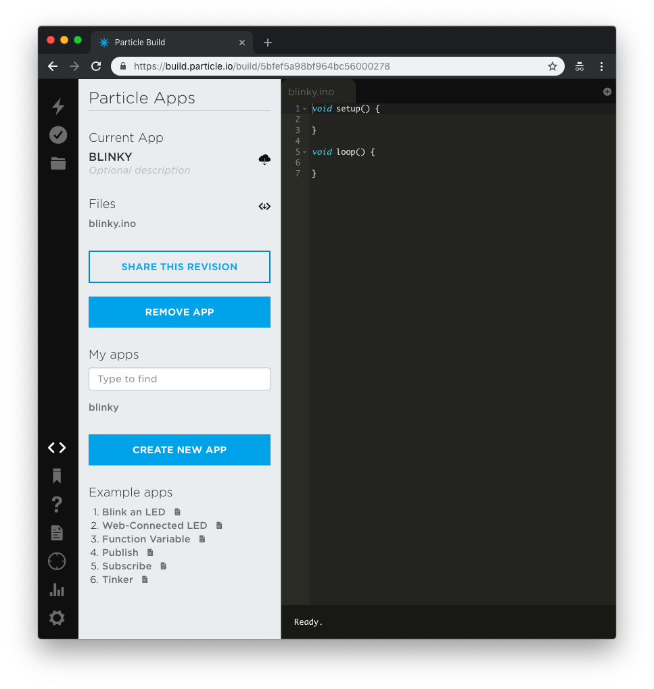

The goal is now to write code that turns the onboard blue LED on and off every second - a hardware equivalent of the classic "Hello world!".

4. The physical pin connected to the blue LED is `D7`, we give it a name, so we can call it later on. Do this _above_ the `setup` function.
  
```cpp
// Blink an LED.
// Declare variables.
int ledPin = D7; // The onboard blue LED is connected to pin D7.
```

5. We now need to configure this pin as an output to be able to control the voltage (`HIGH` or `LOW`). This is done _inside_ the `setup` function.

```cpp
// Set the pin mode to output, so we may control it.
pinMode(ledPin, OUTPUT);
```

6. Turn on the LED by setting the pin value to `HIGH`. This is done _inside_ the `loop` function.

```cpp
// Turn on the LED.
digitalWrite(ledPin, HIGH);
```

7. To keep the LED on for a fixed amount of time before turning it off again, introduce a delay immediately after.

```cpp
// We'll leave it on for 1 second (1000milliseconds).
delay(1000);
```

8. Now turn the LED off by setting the pin value `LOW`.

```cpp
// Turn off the LED.
digitalWrite(ledPin, LOW);
```

9. To finalize the code, add a delay after turning the diode off, so it is off for a while, before the loop restarts and turns the diode back on again.

```cpp
// We'll leave it off for 1 second.
delay(1000);
```

The "blinky" code is now complete, and it is time to flash it to your physical device.

10. Choose which device to target with this code by clicking the crosshair icon in the left pane.
 
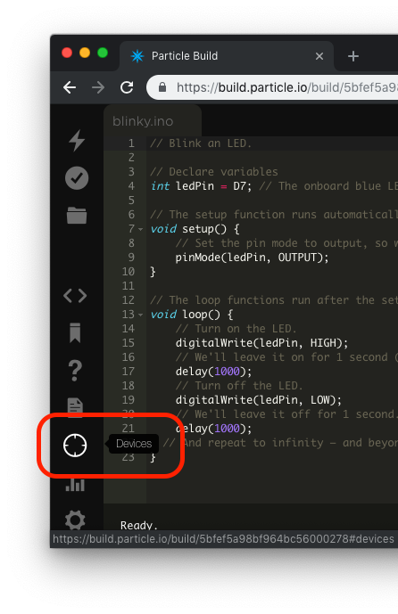


11. Your Argon should be on the list, if you have claimed it successfully. If it is online it will have a "breathing" cyan circle right of its name.
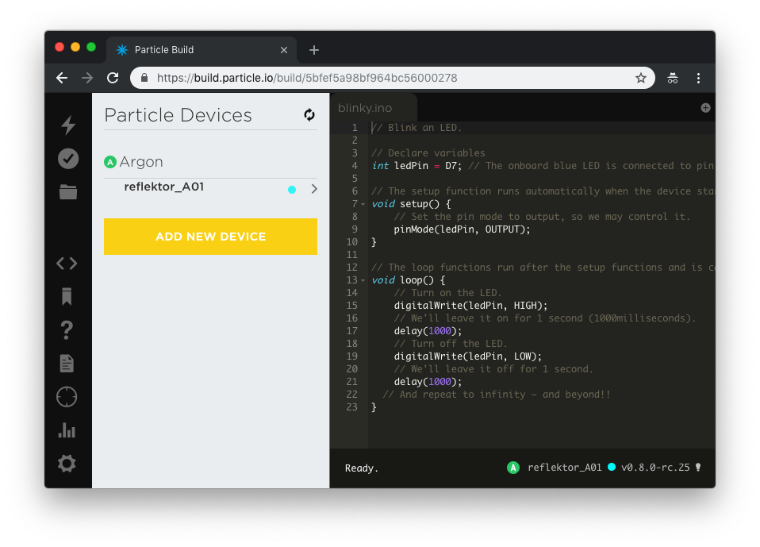


...and that's how you get to blinky!


::: tip Got stuck in the code?
The final code for this lab is [available here](https://go.particle.io/shared_apps/5bfee8278bf964ffb30001ad).
:::

<!---

## Setting up a Xenon

1. Open your glorious new Xenon Kit. Plug it into your computer using the usb cable provided.


1. Once the Xenon powers up for the first time, it will automatically enter "[listening mode](https://docs.particle.io/guide/getting-started/modes/photon/#listening-mode)", which means its ready to be claimed. 

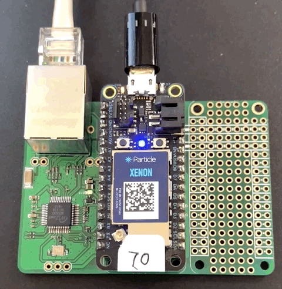

## Claiming the Xenon

The following may also be [done via the CLI](about:blank) (Command Line Interface).


**Note**: Images below are from the iOS app. The flow of the Android setup experience is similar.

1.  Open the Particle Mobile App.

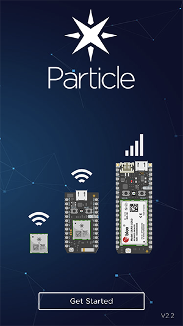

2.  Login, or create a new account if you don't already have one.


3.  On the "Your Devices" screen, click the "+" in the top-right to add a new device.


4.  Select the "Mesh" option and choose the "Xenon" option on the next screen.

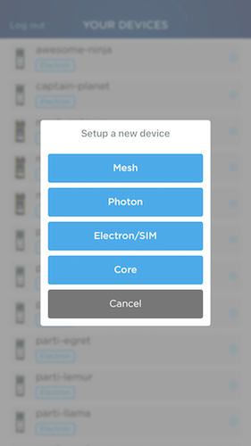

5.  If you haven't done so already, plug your device into power using a USB cable. You can connect to a computer, though this is not required when using the mobile app.

Make sure your device is in "Listening Mode" (indicated by the RGB LED blinking blue). If the Xenon is not in listening mode, hold down the `MODE` button for three seconds, until the RGB LED begins blinking blue.


6. On the next screen, make sure to toggle the "Use with Ethernet?" switch and click the "Xenon is Blinking Blue" button.


6.  The next screen will instruct you to find the data matrix printed on your Xenon and scan it with your Phone's camera. Make sure to allow the app to access your camera to complete this step.

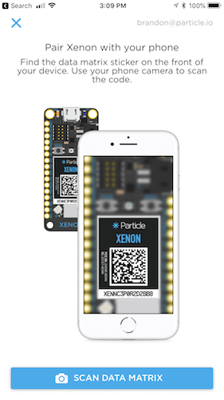
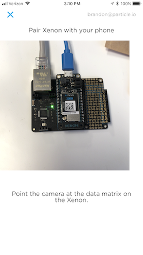

7. The app will now use Bluetooth to pair with your device so that it can be added to the Particle Device Cloud and associated with your account.

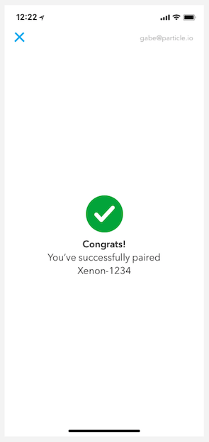

Congratulations, you've claimed your first Xenon. Now, you'll set up your first mesh network.

## Create a Mesh Network

1. Click "Continue onto Mesh Setup."


2. The app will scan for existing networks, and provide an option for creating a new network. Click on the "Create new network..." option.

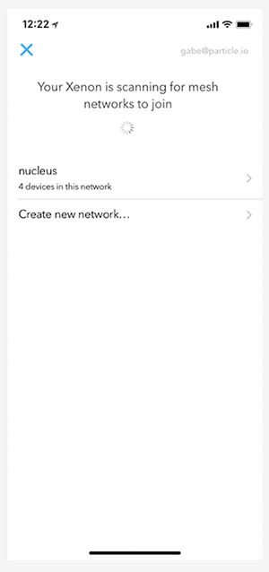

3. Next, give your network a name. Try to give it a personalized name since there are going to be a lot of networks setup for this workshop.


4. And set a password for your network.


5. Once your network is configured, your Xenon will be updated with the network information and configured as a gateway.


6. Finally, you'll be asked to give your new device a name.


7. Congrats, you've configured your first network. Click "I'm Done" and let's explore your new Mesh device with Tinker.


## Interacting with your Xenon with Tinker

Now that you've claimed your Xenon, it's time to light up an LED!

**Note**: images below are from the iOS app. The flow of the Android setup experience is similar.

1.  Open the Particle Mobile App.


2.  Your new device should show up in the list with the name you gave it. If the Tinker firmware is still on the device, you'll see that indicated as well.

Tap the device you want to interact with via Tinker.


3.  When you select a device flashed with the Tinker firmware, you'll see a list of all the GPIO pins on the Xenon. With Tinker, you can control the digital and analog pins via reads and writes. If you have sensors or actuators connected to the Xenon, you can control them with Tinker.


4.  Every Xenon has a blue LED that's connected to pin D7, and you can use Tinker to control this LED. Tap on the circle marked "D7" and you'll see a pop-up that gives you two options, `digitalRead` and `digitalWrite`. Click on `digitalWrite`.


5.  Once you select `digitalWrite` the pin button will be highlighted in red and show its current value. At first, this value will be digital `LOW` (or 0).


6.  Tap the button. You'll notice that it changed to `HIGH` (or 1).


7.  When the value changes to `HIGH`, you'll also notice that the blue light at D7 is on! Behind the scenes, Tinker is calling the `digitalWrite` and passing in either a `LOW` or `HIGH` value, which turns the LED off or on. Press the button again and you'll note that the LED turns back off.


Congratulations! You've claimed and named your first Xenon, and made it light up using the Tinker app. Now it's time to bring a second Xenon online and create your first Particle Mesh network!

# Setting up your first Mesh network

| **Project Goal**            | Create a Mesh network and connect a second Xenon to it                                                              |
| --------------------------- | ------------------------------------------------------------------------------------------------------------------- |
| **What you’ll learn**       | How-to: add a second device to your Mesh network; communicate through a Mesh gateway to an endpoint device.         |
| **Tools you’ll need**       | A Xenon, Ethernet FeatherWing, access to an Ethernet port, Xenon connected to a PartiBadge, the Particle Mobile App |
| **Time needed to complete** | 15 minutes                                                                                                          |

In the last session, you configured your first Xenon and set-up a mesh network. In this session, you're going to add a second Xenon (the one in your PartiBadge) to that mesh network and interact with your second device via the gateway.

## Add your PartiBadge Xenon to your Mesh Network

Your PartiBadge Xenon has already been configured with firmware and added to the Spectra mesh network. In this section, you'll claim the Xenon in your to your account and add it to your personal mesh network.

1.  In the mobile app, on the "Your Devices" screen, click the "+" in the top-right to add a new device.


2.  Select the "Mesh" option and choose "Xenon" on the next screen.


3. Hold the SETUP button on your PartiBadge Xenon for three seconds until is starts blinking blue, indicating that it has entered Listening Mode.


4. You'll now follow the same device claiming flow you used for your first Xenon. Follow the on-screen instructions and scan the data matrix on your Xenon to pair with it.

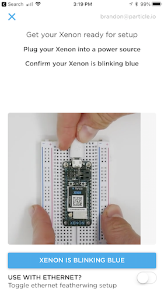

5. Select the network you created in the last section.


6. You'll be instructed now to pair your phone wih an "assisting device." An assisting device is a device on a mesh network that will help your new device join the network. In this case, that device is your Ethernet FeatherWing gateway. Put the Gateway Xenon into listening mode by holding down the `MODE` button for 3 seconds until it begins blinking blue.


8. Scan the data matrix on the Gateway Xenon and wait for the pairing to complete.


7. When prompted, enter the network password you specified in the last section.


Congratulations! You now have a Particle Mesh network of two devices. Let's explore the power of Mesh by controlling your Badge Xenon from the cloud.

## Explore your mini Mesh network

In the last lab, you learned how to control a Particle device running the default Tinker firmware using the mobile app. In this section, you'll use the Particle Console to control your PartiBadge using Cloud Functions, which we'll learn more about in the next module.

1. Open a browser tab and navigate to [console.particle.io](https://console.particle.io). Log in with your Particle account, if prompted.

2. Your device dashboard will show all of the Particle devices you own. You should see at least two, one for your gateway/ethernet-connected Xenon and one for your badge Xenon. Click on the badge Xenon.

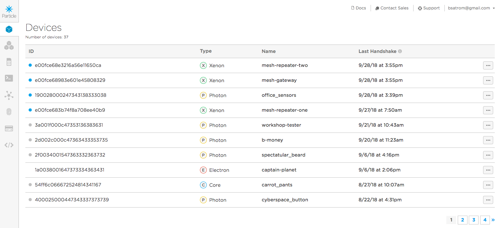

3. Your PartiBadge was pre-loaded with firmware. That firmware includes several Particle Cloud Functions and variables, which you can see listed on the right side of the overview screen for your device.

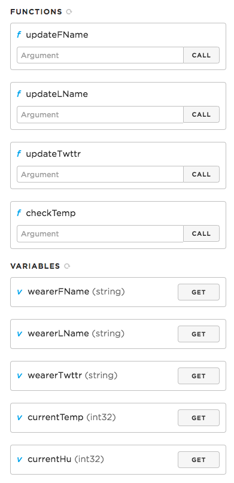

4. Set the name on your badge so it can be uniquely yours! Find the function named `updateFName` and enter your first name in the text box.

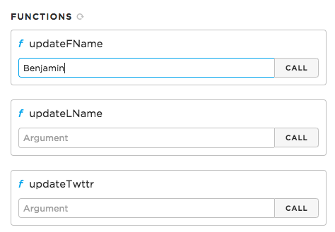

5. Click `Call`. If the function call succeeded, a "1" should appear next to the function name.

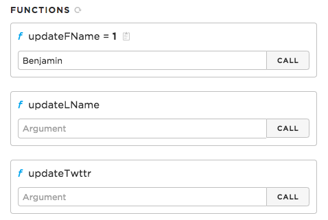

6. Now, enter your last name in the `updateLName` box and click `Call`. Optionally, you can enter your Twitter handle in the `updateTwttr` box.

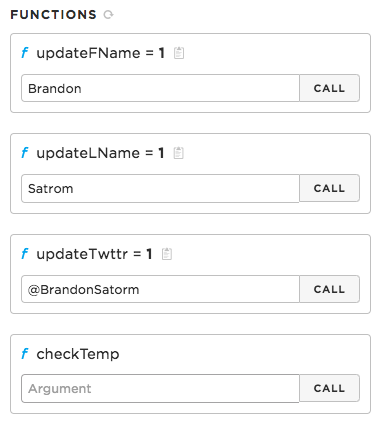

7. To confirm everything has been set correctly, you can click `Get` on the Particle variables for `wearerFName`, `wearerLName` and `wearerTwttr`. If the value you get back is the one you entered, you're good to go!

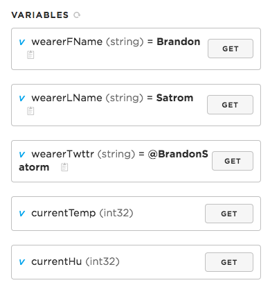

8. Now it's time to see your name in lights! Grab your PartiBadge and activate the menu by clicking the joystick or one of the LED buttons. Click the `Display` menu item, then `Name`. You should see your name (and Twitter handle, if your set it) scrolling across the screen!

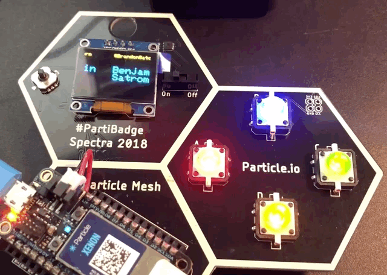

It's important to note that the Xenon in your PartiBadge does not have a Wi-Fi or cellular radio and thus, does not have a connection to the Internet. But Particle Mesh knows that your badge is connected via your gateway, and how to route messages through the gateway to your endpoint device. All you have to do is enter some text and click buttons!

To underscore that this is the case, try accessing your badge when your gateway Xenon is disconnected.

9. Unplug the Ethernet cable from your gateway Xenon.

10. Navigate back to the [Particle Console](https://console.particle.io) and open the dashboard for your device.

11. Try changing your first or last name and clicking "Call." You should get a timeout message toast at the bottom of the screen. If you try re-displaying your name, it should be unchanged.

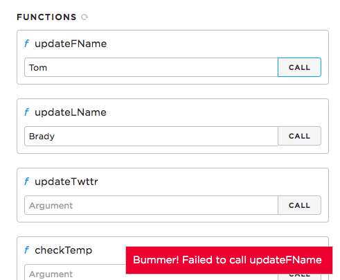

12. Plug an Ethernet cable back into your FeatherWing and repeat the last few steps. Everything should work.

Congratulations on setting up your first Particle Mesh network and exploring how mesh devices work together! In our last lab, you'll learn how to explicitly send messages between Mesh devices, as well as using Particle Cloud Functions, variables and Device Cloud events.


# Programming your devices

## Using the Particle Web IDE

In this section, you'll use the Web IDE to create firmware for your gateway Xenon. The Web IDE makes it accessible to program devices and learn the Particle ecosystem without having to install a local toolchain.

1.  Navigate to [build.particle.io](http://build.particle.io). You may need to log-in, if prompted.

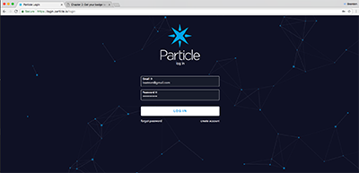

2.  Once you log-in, you may be directed to the Particle home page. If so, [click here to navigate](https://build.particle.io) back to Web IDE.

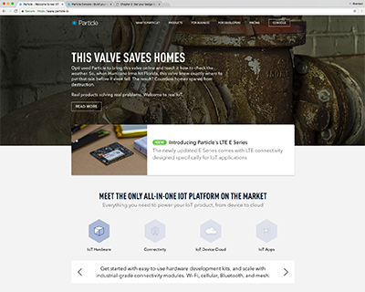

3.  When navigating to the Web IDE, the first thing you'll see is an empty editor window for a new project and a prompt to give that project a name.

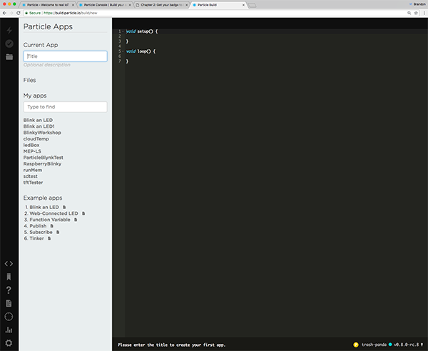

4.  In the Current App textbox, give your app a name (like "MeshWorkshop") and hit enter.

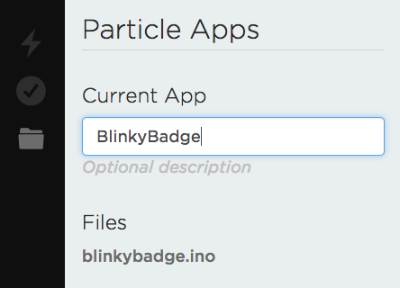

5.  Once you've given your project a name, you're ready to code!

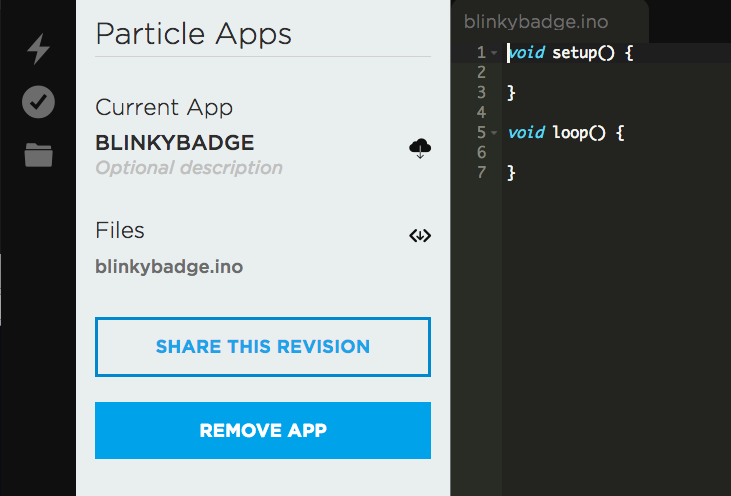

## The `setup()` and `loop()` functions

::: tip
If you're new to embedded or IoT development, this section is for you!
:::

Before you dive into your first bit of code, a brief word about the two functions that were auto-populated into your new app. If you've done Wiring or Particle development before, you're already familiar with these and can skip ahead. If not, read on.

Every Particle application _must_ have two functions in the main file (sometimes called a "sketch"): `setup()` and `loop()`. Both of these functions are called by the Particle Device OS.

True to its name, `setup()` runs only only once when the device starts up and is used for initializing buttons, sensors, and other things needed to get your project ready to execute.

`loop()`, on the other hand, executes over and over again as long as your firmware is running on the device. When the function is called by Device OS, the code inside executes sequentially until it reaches the closing brace of the function, before being called again.

While the speed at which the `loop()` function executes is determined by the specific hardware and the time needed to execute the use code you've written in the function, it's important to know that, much of the time, this function will run very fast.

The bulk of your program, from state management, handling user input, reading from sensors, and more will take place inside of the `loop()` function. It can take a bit of getting used to if you're not familiar with this style of development, but once you become comfortable, you'll enjoy the power this control provides you as a firmware developer.

-->